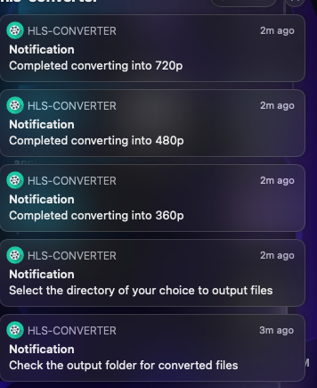

## Electron App which convert the input (.mp4) video to HLS (HTTP Live Streaming Video Format) 

### 

#### Click the following link to download the (.exe) file
##### [Windows executable File](https://drive.google.com/file/d/10gvpZ6r2_DsUbBexA76vIDzHcbXVWvts/view?usp=sharing)

#### Click the following link to download the (macos executable) file
##### [Mac App](https://drive.google.com/drive/folders/1Kfb4FywhMDAHgWqFyLHV7X6W0cse05wg?usp=sharing)

### Application Preview
#### 1. Home Screen

#### 2. Click and select the video

#### 3. Select (.mp4) files to convert them, you are not allowed to select files of other format

#### 4. Will receive notifications regarding the status of video conversion
