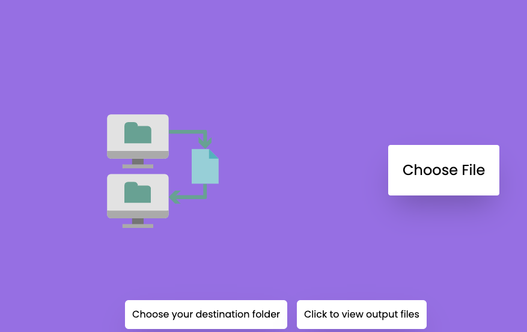

## Electron App which convert the input (.mp4) video to HLS (HTTP Live Streaming Video Format) 

### 

### Application Preview
#### 1. Home Screen

#### 2. Click and select the video

#### 3. Select (.mp4) files to convert them, you are not allowed to select files of other format

#### 4. Will receive notifications regarding the status of video conversion
